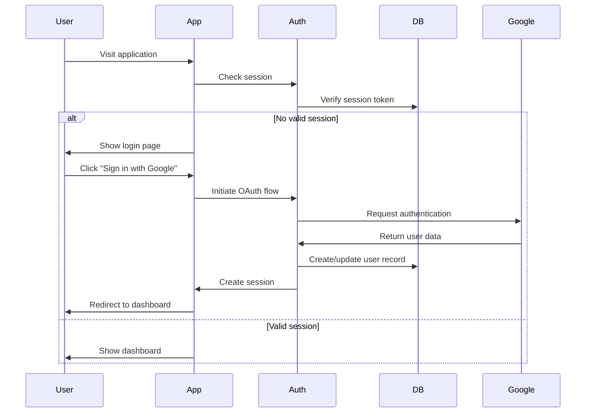
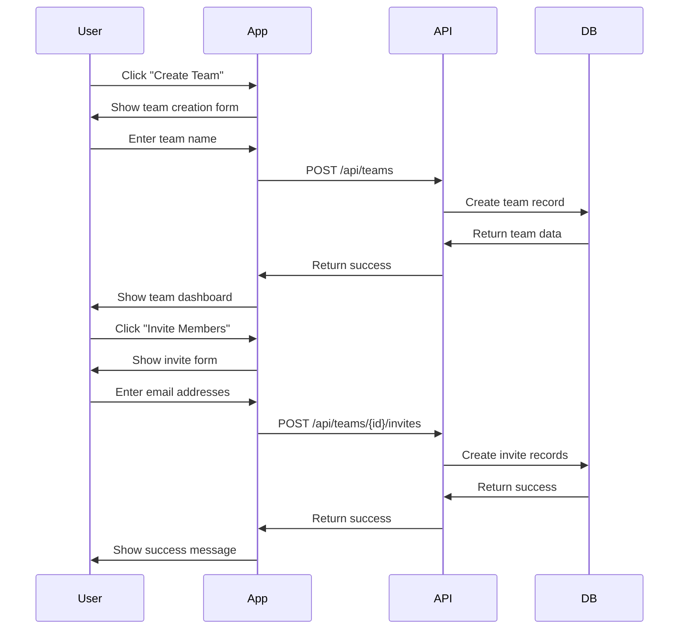
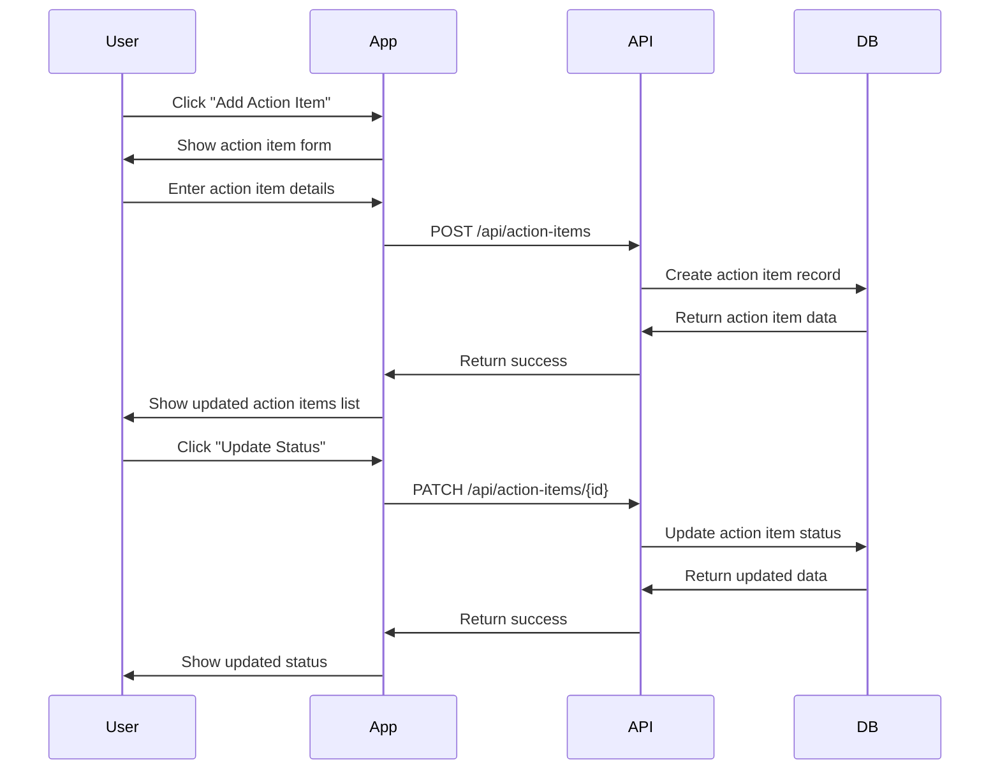
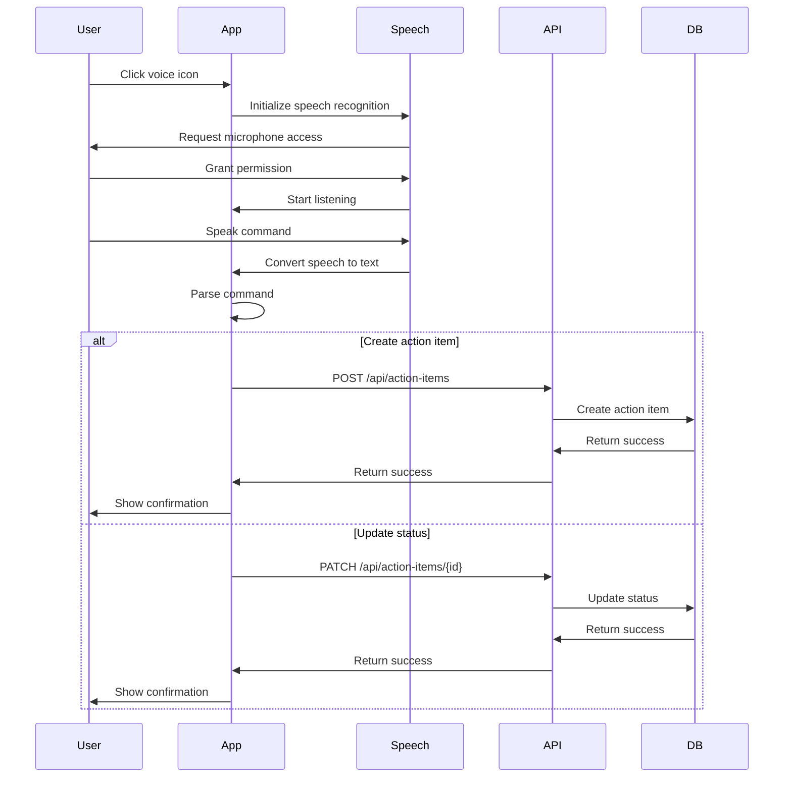

# Product Flows

## User Journeys

### 1. Authentication Flow

### 2. Team Management Flow

### 3. Action Item Flow

### 4. Voice Navigation Flow

## Feature Flows

### 1. Team Dashboard
1. User logs in
2. System loads user's teams
3. User selects a team
4. System displays:
   - Team members list
   - Action items summary
   - Recent activity
   - Team settings (if admin/owner)

### 2. Action Items Management
1. User views team dashboard
2. System loads action items
3. User can:
   - Create new action item
   - Filter by status/priority
   - Sort by due date/priority
   - Update item status
   - Assign to team members
   - Add comments

### 3. Team Member Management
1. Team owner/admin views team settings
2. System displays member list
3. Owner/admin can:
   - Invite new members
   - Change member roles
   - Remove members
   - View member activity

### 4. Voice Commands
1. User clicks voice icon
2. System requests microphone access
3. User grants permission
4. System listens for commands:
   - "Create action item [title]"
   - "Assign [item] to [member]"
   - "Update [item] status to [status]"
   - "Set [item] priority to [priority]"
   - "Set [item] due date to [date]"

## Error Handling

### 1. Authentication Errors
- Invalid credentials
- Session expired
- OAuth provider errors
- Network issues

### 2. Team Management Errors
- Duplicate team names
- Invalid member invites
- Permission denied
- Team not found

### 3. Action Item Errors
- Invalid dates
- Missing required fields
- Invalid status/priority
- Assignment errors

### 4. Voice Navigation Errors
- Microphone access denied
- Speech recognition failed
- Invalid command format
- Ambiguous commands

## Success Messages

### 1. Authentication
- "Successfully signed in"
- "Account created successfully"

### 2. Team Management
- "Team created successfully"
- "Member invited successfully"
- "Team settings updated"

### 3. Action Items
- "Action item created"
- "Status updated successfully"
- "Assignment updated"

### 4. Voice Commands
- "Action item created: [title]"
- "Status updated to: [status]"
- "Priority set to: [priority]"

## Loading States

### 1. Authentication
- Signing in...
- Creating account...
- Verifying session...

### 2. Team Management
- Creating team...
- Loading members...
- Updating settings...

### 3. Action Items
- Loading items...
- Creating item...
- Updating status...

### 4. Voice Navigation
- Initializing speech recognition...
- Processing command...
- Updating item...

## Empty States

### 1. Teams
- "No teams yet"
- "Create your first team"
- "No members in this team"

### 2. Action Items
- "No action items"
- "Create your first action item"
- "No items match your filters"

### 3. Team Members
- "No members yet"
- "Invite your first team member"
- "No pending invites"

## Navigation Patterns

### 1. Main Navigation
- Dashboard
- Teams
- Settings
- Profile

### 2. Team Navigation
- Overview
- Members
- Action Items
- Settings

### 3. Action Item Navigation
- List view
- Board view
- Calendar view
- Filters

### 4. Settings Navigation
- Team settings
- Member management
- Notification preferences
- Integration settings 